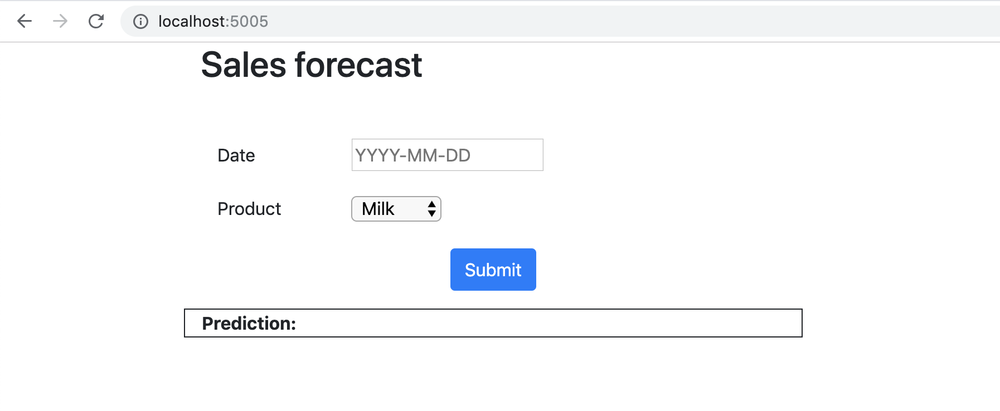
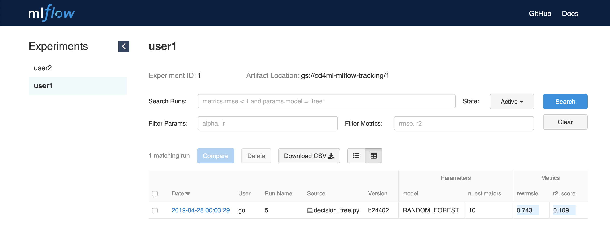
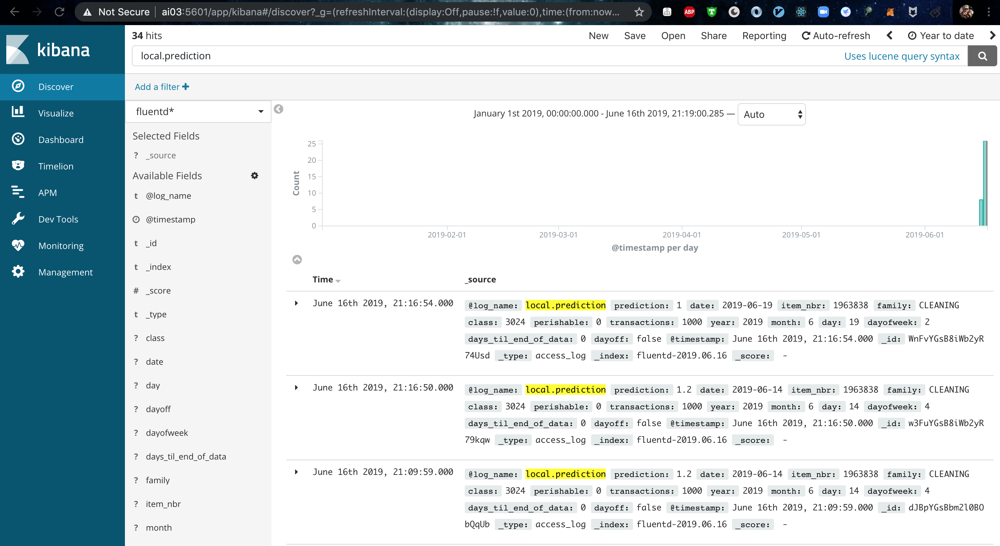
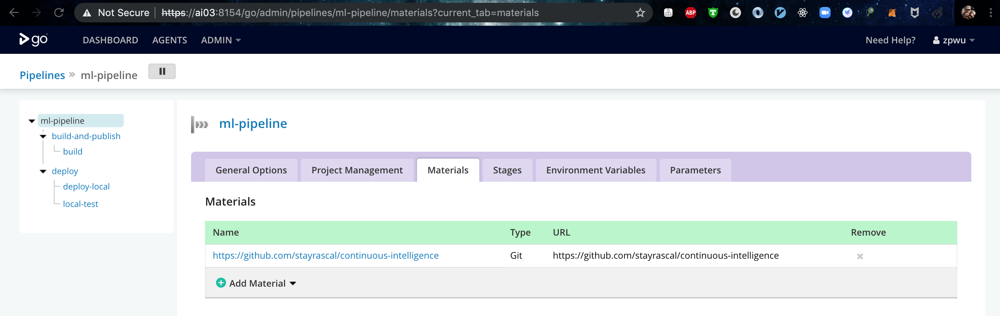
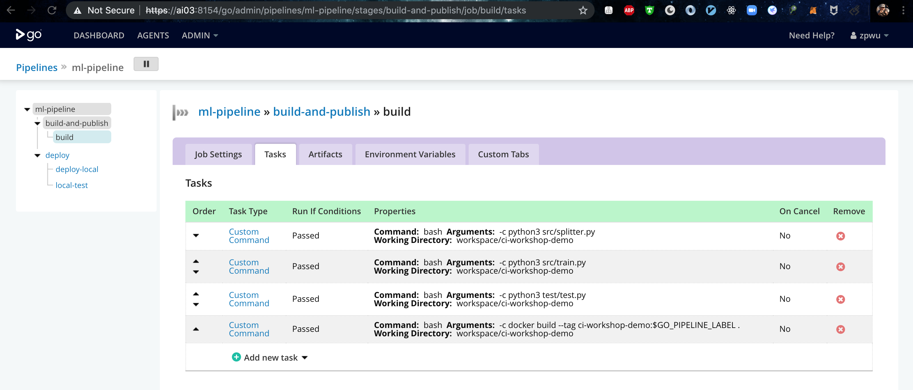
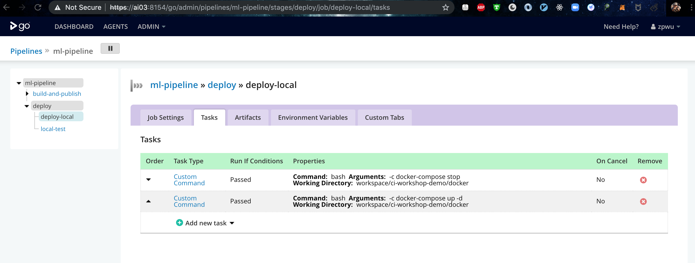
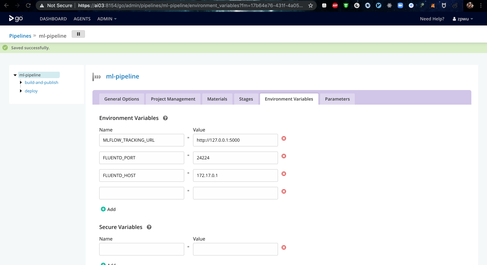

# Continuous Intelligence Workshop

A demo on how to apply continuous delivery principles to train, test and deploy ML models. This repository is forked from https://github.com/ThoughtWorksInc/continuous-intelligence-workshop.

### Local Build
1. Please ensure you've completed the [pre-requisite setup](./docs/pre-requisites.md)

2. Fork repository: https://github.com/stayrascal/continuous-intelligence

3. Clone repository: `git clone https://github.com/YOUR_USERNAME/continuous-intelligence`

4. Enter ci-workshop-demo folder: `cd ci-workshop-demo`

5. Install the dependencies: `pip3 install --no-cache-dir -r requirements.txt`

6. Prepar data: `python3 src/splitter.py`

7. Build Model: `python3 src/train.py`

8. Validate metric: `python3 test/test.py`

9. Start application: `python3 src/app.py`, and to test and see the application running locally, open a browser tab, go to http://localhost:5005, and you should see the application like:
<kbd></kbd>

### Docker Build
1. Please ensure you've completed the process from **Local Build**

2. Build base image: `docker build -t ci-workshop-demo-base -f Dockerfile-base .`

3. Build application image: `docker build . -t ci-workshop-demo`

4. Run the Docker container: `docker run -d -p 5005:5005 ci-workshop-demo`

5. Test and see the application running locally, open a browser tab, go to http://localhost:5005

### Setup ELF and MLflow Server
1. Follow the instructions from [docker-efk README.md](../docker-efk/README.md)

### Tracking Experiments In Local
1. Setup the environment variable **MLFLOW_TRACKING_URL**: `export MLFLOW_TRACKING_URL=http://loclahost:5000`

2. Rebuild model under ci-workshop-demo folder: `python3 src/train.py`

3. Visit the MLflow URL to find your experiment resuts.
<kbd></kbd>	

### Model Monitoring In Local
1. Setup the environment variable **FLUENTD_HOST** and **FLUENTD_PORT**: `export FLUENTD_HOST=127.0.0.1 & export FLUENTD_PORT=24224`

2. Start application: `python3 src/app.py`, and to test and see the application running locally, open a browser tab, go to http://localhost:5005

5. Visit your application in production to make a few predictions.

6. Visit the Kibana URL http://localhost: and click on the *"Discover"*
menu.

7. In the search field, find the entries tagged with your user, with a query
string `local.prediction`

8. Click *"Refresh"* and you should see your predictions logged!

<kbd></kbd>

### Machine Learning pipeline
1. Setup up GoCD: go to gocd-docker-compose folder, run the command: `docker-compose up -d`
2. Create machine learning training pipeline in GoCD:
	- Configure your Github repository URL as a Git material
	<kbd></kbd>
	- Add two stages: **build-and-publish** and **deploy**
	- Expand the "build-and-publish" stage, add follow jobs:
	<kbd></kbd>
	- Expand the "deploy" stage, add follow jobs:
	<kbd></kbd>
	- Open the *"Environment Variables"* tab and configure the URL to the MLFlow
tracking server and your tenant:

  		* `MLFLOW_TRACKING_URL = http://127.0.0.1:5000`
  		* `FLUENTD_PORT = 24224`
  		* `FLUENTD_HOST = DOCKER_IP`

  		<kbd></kbd>
3. Add new commit, and push your changes, and watch your pipeline
4. Once the machine learning pipeline succeeds, it will trigger a new application deployment pipeline, which will pull the new improved model and deploy it to production. Visit your application again to verify that you get better predictions!